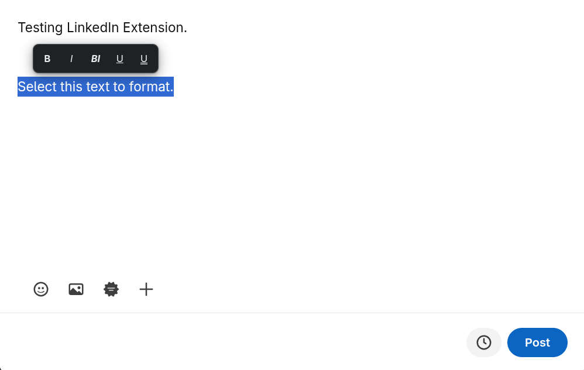
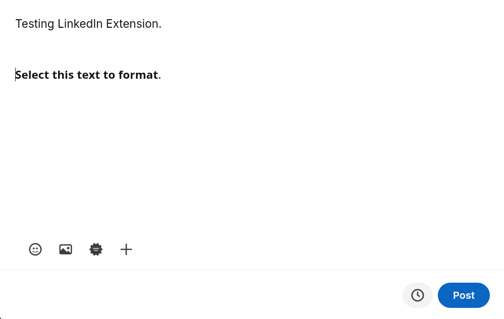
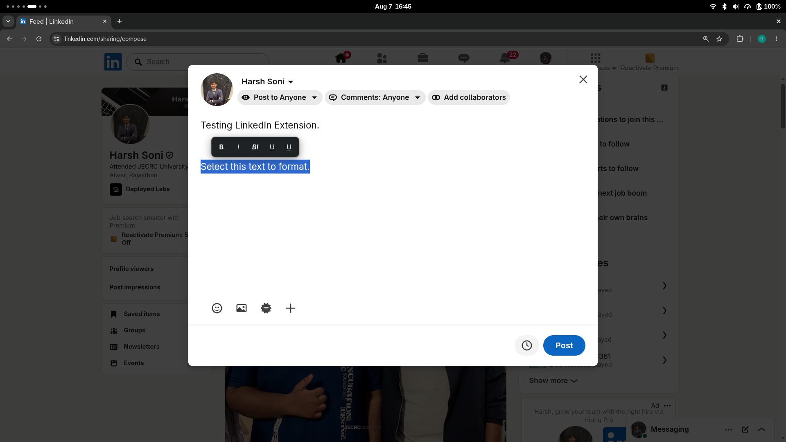
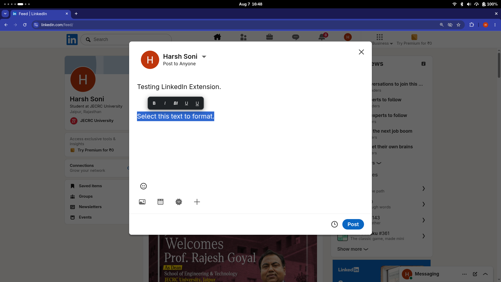

# LinkedIn Text Formatter Extension

LinkedIn Text Formatter is a lightweight Chrome extension that lets users format selected text in LinkedIn's Create a Post editor as Bold, Italic, Bold Italic, Underline or Double Underline using Unicode characters.

---

## Project Status

- **Version:** 0.1.0 (Manifest V3)
- **Current Phase:** Phase 13 — Documentation ([~] In Progress)
- **Automated Test Coverage:** 10 zero-dependency Node test suites passing (440+ tests, 0 failures)
- **Chrome Web Store Status:** Unpacked developer extension (not currently published on the Chrome Web Store)

---

## Problem Being Solved

LinkedIn's native post composer does not provide built-in formatting controls for bold, italic, or underlined text. Previously, users who wanted to add visual hierarchy or emphasis to their LinkedIn posts had to follow a tedious workflow:

1. Leave LinkedIn and open an external font generator website.
2. Type or paste text into the external site.
3. Copy the converted Unicode output.
4. Return to LinkedIn.
5. Paste the text back into the post composer.

The LinkedIn Text Formatter extension eliminates this friction by keeping the entire formatting workflow **directly inside LinkedIn's post composer**.

---

## How the Extension Works

The extension injects a lightweight content script into `https://www.linkedin.com/*`. When you highlight plain text inside LinkedIn's supported post editor, a floating contextual toolbar appears near your selection. Clicking any style button instantly converts the selected ASCII characters into equivalent Unicode mathematical alphanumeric symbols locally in memory.

*Note:* This extension performs **Unicode character conversion**, not native HTML rich-text formatting (`<b>`, `<i>`). The converted characters are standard UTF-8 Unicode glyphs that persist wherever plain text is supported.

---

## Features

- **Contextual Floating Toolbar:** Appears automatically near valid text selections inside the post editor.
- **Five Formatting Styles:** Bold, Italic, Bold Italic, Underline, and Double Underline.
- **Dual Composer Support:** Operates seamlessly across standard direct-document post editors and open Shadow DOM Quill editors (`DIV.ql-editor` inside `DIV#interop-outlet`).
- **Entity Protection (QA-001):** Rejects selections overlapping links (`a[href]`), mentions (`@name`), protected rich nodes, and plain-text URLs (`https://...`) to prevent corrupting LinkedIn link entities.
- **100% Local & Private:** Text conversion is performed in-memory inside your browser tab. Zero network requests, zero data collection, zero tracking.
- **Keyboard & Accessibility Support:** Keyboard activation via Enter/Space, Escape dismissal, visible focus indicators, dark mode support, and reduced-motion preferences.
- **Information Popup:** Provides quick reference guide, style previews, version badge, and privacy guarantees.

---

## Supported Formatting Styles

The extension supports 5 verified formatting styles. All examples below are produced directly by the formatter engine:

| Style | Label | Example Output | Unicode Block / Mechanism |
|---|---|---|---|
| **Bold** | `B` | 𝐁𝐨𝐥𝐝 | Mathematical Bold (`U+1D400`–`U+1D433`, `U+1D7CE`–`U+1D7D7`) |
| **Italic** | `I` | 𝐼𝑡𝑎𝑙𝑖𝑐 | Mathematical Italic (`U+1D434`–`U+1D467`, `U+1D455` for 'h') |
| **Bold Italic** | `BI` | 𝑩𝒐𝒍𝒅 𝑰𝒕𝒂𝒍𝒊𝒄 | Mathematical Bold Italic (`U+1D468`–`U+1D49B`) |
| **Underline** | `U` | U̲n̲d̲e̲r̲l̲i̲n̲e̲ | Combining Low Line (`U+0332`) |
| **Double Underline** | `U=` | D̳o̳u̳b̳l̳e̳ ̳U̳n̳d̳e̳r̳l̳i̳n̲e̲ | Combining Double Low Line (`U+0333`) |

---

## Supported LinkedIn Scope

The extension is strictly scoped to **LinkedIn's Create a Post editor** on `https://www.linkedin.com/*`:

- **Supported:** Direct-document post composer (`/sharing/compose`, main feed modal) and open Shadow DOM post editor (`DIV.ql-editor`).
- **Unsupported & Excluded:** LinkedIn Comments, Messaging, Article / Newsletter editor (`/pulse/`), Search input boxes, CAPTCHAs, and mobile web browsers.

---

## Installation in Developer Mode

To install the extension for local testing or development:

1. Clone the repository to your local machine:
   ```bash
   git clone https://github.com/HarshSoni200706/linkedin-text-formatter-extension.git
   cd linkedin-text-formatter-extension
   ```
2. Open Google Chrome and navigate to `chrome://extensions/`.
3. Enable **Developer mode** using the toggle switch in the top-right corner.
4. Click the **Load unpacked** button.
5. Select the repository root folder containing `manifest.json`.
6. (Optional) Pin the extension icon to your Chrome toolbar for quick access to the information popup.
7. Open or refresh `https://www.linkedin.com`.

---

## Usage Instructions

### General Usage
1. Open LinkedIn and click **Start a post**.
2. Type your post content in the composer.
3. Highlight the plain text you want to format.
4. The floating formatting toolbar will appear above your selection.
5. Click your desired formatting style (`B`, `I`, `BI`, `U`, `U=`).
6. The selected text is converted locally. Continue typing or publish your post.

### Mouse Workflow
- Highlight text with your mouse cursor inside the post composer.
- Click any formatting button on the floating toolbar.
- Click outside the toolbar or selection to dismiss it.

### Keyboard Workflow
- Highlight text using standard keyboard selection (`Shift + Arrow Keys`).
- Press `Tab` to shift focus onto the floating toolbar buttons.
- Press `Enter` or `Space` to activate the focused formatting style.
- Press `Escape` at any time to dismiss the floating toolbar.

---

## Screenshots

### Floating Formatting Toolbar



### Formatting Result



### Extension Popup

> [!NOTE]
> Extension information popup showing usage steps, style previews, version badge `v0.1.0`, and privacy guarantee.

### Dark Appearance

> [!NOTE]
> Contextual floating toolbar and extension popup adapt automatically to system dark mode via `prefers-color-scheme: dark`.

### Supported LinkedIn Composer Layouts

<table>
  <tr>
    <td width="50%" align="center">
      <strong>Direct-Document Composer (Layout A)</strong><br><br>
      
    </td>
    <td width="50%" align="center">
      <strong>Open Shadow DOM Composer (Layout B)</strong><br><br>
      
    </td>
  </tr>
</table>

---

## Project Structure

```
linkedin-text-formatter-extension/
├── assets/
│   ├── icons/
│   │   ├── icon-16.png
│   │   ├── icon-32.png
│   │   ├── icon-48.png
│   │   └── icon-128.png
│   └── screenshots/
│       └── README.md
├── docs/
│   ├── development/
│   │   ├── linkedin-editor-detection.md
│   │   └── updating-unicode-mappings.md
│   ├── qa/
│   │   └── phase-11-test-report.md
│   ├── release/
│   │   └── packaging.md
│   ├── security/
│   │   └── phase-12-security-review.md
│   └── testing/
│       └── manual-testing-checklist.md
├── src/
│   ├── content/
│   │   ├── content-script.js
│   │   ├── editor-manager.js
│   │   ├── selection-manager.js
│   │   ├── text-replacement-manager.js
│   │   └── toolbar-manager.js
│   ├── formatter/
│   │   ├── text-formatter.js
│   │   ├── text-normalizer.js
│   │   └── unicode-maps.js
│   ├── popup/
│   │   ├── popup.css
│   │   ├── popup.html
│   │   └── popup.js
│   ├── shared/
│   │   ├── constants.js
│   │   └── utilities.js
│   └── styles/
│       └── content-toolbar.css
├── tests/
│   ├── editor-detector.test.js
│   ├── formatter.test.js
│   ├── popup.test.js
│   ├── quality-assurance.test.js
│   ├── security-privacy.test.js
│   ├── selection-manager.test.js
│   ├── text-replacement-manager.test.js
│   ├── toolbar-manager.test.js
│   ├── ux-accessibility.test.js
│   └── runner.html
├── CHANGELOG.md
├── CONTRIBUTING.md
├── LICENSE
├── PRIVACY.md
├── README.md
├── manifest.json
└── tasks.md
```

---

## Technology Stack

- **Extension Platform:** Chrome Extension Manifest V3
- **Languages:** Plain JavaScript (ES6+), HTML5, Vanilla CSS3
- **Character Standard:** Unicode Mathematical Alphanumeric Symbols & Combining Diacritical Marks
- **APIs:** Browser Selection & Range APIs, DOM Traversal & Mutation APIs, Chrome Extension Runtime API
- **Interoperability:** Open Shadow DOM resolution via `event.composedPath()` and `getRootNode()`
- **Testing Environment:** Zero-dependency Node.js unit test suites

---

## Architecture Overview

The extension uses a modular, decoupled architecture:

- **`EditorManager` (`editor-manager.js`):** Scored multi-signal detector identifying supported post editors across direct-document (Layout A) and open Shadow DOM (Layout B) containers while enforcing exclusions.
- **`SelectionManager` (`selection-manager.js`):** Listens for selection events, validates boundaries, enforces protected entity/URL checks (QA-001), and maintains temporary selection ranges.
- **`ToolbarManager` (`toolbar-manager.js`):** Manages a single canonical floating toolbar element, handles host reparenting across DOM/Shadow DOM nodes, clamping, and visibility state.
- **`TextReplacementManager` (`text-replacement-manager.js`):** Executes text formatting transactions via selection deletion and node insertion with DOM fallback and rollback safety.
- **`Formatter Engine` (`text-formatter.js`, `unicode-maps.js`, `text-normalizer.js`):** Pure in-memory transformation pipeline converting ASCII strings to Unicode mathematical character representations.
- **`Popup` (`popup.html`, `popup.js`, `popup.css`):** Standalone extension interface showing usage instructions, style previews, and metadata.

---

## Running Automated Tests

The repository includes zero-dependency Node test suites:

```bash
# Run individual test suites
node tests/formatter.test.js
node tests/editor-detector.test.js
node tests/selection-manager.test.js
node tests/toolbar-manager.test.js
node tests/text-replacement-manager.test.js
node tests/popup.test.js
node tests/ux-accessibility.test.js
node tests/quality-assurance.test.js
node tests/security-privacy.test.js

# Run all test suites in sequence
for suite in tests/*.test.js; do node "$suite"; done
```

---

## Manual Testing

For comprehensive manual quality assurance instructions across supported LinkedIn editor layouts, refer to:

- [docs/testing/manual-testing-checklist.md](docs/testing/manual-testing-checklist.md)
- [docs/qa/phase-11-test-report.md](docs/qa/phase-11-test-report.md)

---

## Privacy

**Your text stays in your browser.** The LinkedIn Text Formatter extension processes all text locally on your device using only in-memory Unicode character mapping.

- **Zero Data Upload:** Selected text is never sent to external servers or remote endpoints.
- **Zero Persistent Storage:** The extension does not write to Chrome Storage, `localStorage`, `sessionStorage`, IndexedDB, or cookies.
- **Zero Telemetry:** No analytics libraries, error trackers, or tracking pixels are included.
- **Zero Clipboard Access:** The extension does not read or write the system clipboard.
- **No Account Access:** The extension does not read or collect LinkedIn account details or session tokens.

Read the complete [PRIVACY.md](PRIVACY.md) policy for full disclosures.

---

## Security

- **Least Privilege:** Declares **zero permissions** (`permissions: []`) in `manifest.json`.
- **Restricted Host Access:** Content scripts run strictly on `https://www.linkedin.com/*`.
- **Safe DOM Operations:** All DOM element creation uses safe methods (`createElement`, `textContent`, `setAttribute`). `innerHTML` and `eval` are strictly forbidden.
- **Local Assets Only:** All JavaScript, CSS, and HTML files are bundled locally inside the extension. No remote code or CDN dependencies are loaded.
- **Production Logging Silenced:** Production code keeps `DEBUG = false` to prevent emitting internal state to the browser console.

Review the complete security audit in [docs/security/phase-12-security-review.md](docs/security/phase-12-security-review.md).

---

## Accessibility

> [!WARNING]
> **Screen Reader Notice:**
> Styled text uses Unicode mathematical characters rather than native HTML formatting (`<b>`, `<i>`). Some screen readers may read mathematical Unicode characters as individual symbol names (e.g. "Mathematical Bold Capital B") rather than normal words. Use formatted text primarily for headings, titles, and short emphasis phrases.

- **Keyboard Control:** Floating toolbar buttons support keyboard focus (`Tab`) and activation (`Enter` / `Space`).
- **Dismissal:** Pressing `Escape` hides the floating toolbar immediately.
- **Visual Design:** High contrast button styles with visible focus indicators (`outline: 2px solid #0a66c2`).
- **Reduced Motion:** Respects `prefers-reduced-motion: reduce` by disabling non-essential transitions.

---

## Known Limitations

- **Supported Scope:** Operates exclusively inside LinkedIn's Create a Post editor. Comments, messaging, articles, search fields, and mobile web browsers are not supported.
- **Protected Entities:** Links, mentions (`@name`), protected elements, and plain-text URLs (`https://...`) are intentionally rejected to prevent corrupting LinkedIn entity structures.
- **Accessibility:** Screen readers treat Unicode mathematical characters differently from plain ASCII text.
- **Character Coverage:** Non-Latin character sets (such as Cyrillic, CJK, or Arabic) are preserved as plain unformatted characters.
- **LinkedIn DOM Evolution:** Structural updates by LinkedIn may require periodic editor detection maintenance.

---

## Development Roadmap

### Version 0.1 (Current)
- Stable 5-style Unicode formatting engine
- Dual layout support (Direct-document and open Shadow DOM)
- Entity and URL protection (QA-001)
- Zero-permission security and privacy architecture

### Future Possibilities (Post-V1)
- Optional user settings popup
- Additional Unicode styling variants (e.g. Script, Monospace)
- Extended editor detection for new LinkedIn composer revisions

### Explicitly Out of Scope
- Support for LinkedIn messaging or comments
- Account synchronization or remote backend analytics
- Native rich-text formatting export (`.docx`, `.rtf`)

---

## Contributing

We welcome contributions! Please review our [CONTRIBUTING.md](CONTRIBUTING.md) guide for branch naming conventions, commit guidelines, coding rules, and testing instructions.

---

## License

This project is licensed under the terms of the **MIT License**. See the [LICENSE](LICENSE) file for complete license text.

---

## Disclaimer

LinkedIn Text Formatter is an independent open-source Chrome extension. This project is **not affiliated with, endorsed by, or sponsored by LinkedIn Corporation** or Microsoft Corporation. "LinkedIn" is a registered trademark of LinkedIn Corporation.
